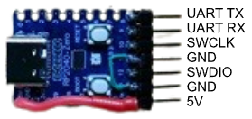
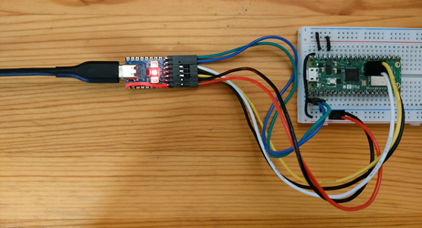
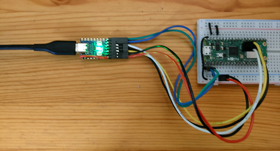

# Raspberry Pi Debug Probe with RP2040-Zero

Forked from the original [Raspberry Pi Debug Probe](https://github.com/raspberrypi/debugprobe) and modified to run on the RP2040-Zero board, which is a compact and cost-effective development board based on the RP2040 microcontroller.

Modifications are:

- Adjusted pin configurations to match the RP2040-Zero's layout.
- Uses the onboard full-color LED WS2812 for status indication.
- Modified `CMakeLists.txt` to target the RP2040-Zero by default.

## Building and Flashing

1. Clone the repository:

   ```
   $ git clone https://github.com/ypsitau/picozero-debugprobe
   $ cd picozero-debugprobe
   ```

2. Initialize and update submodules:

   ```
   $ git submodule update --init --recursive
   ```
3. Build the project:

   ```
   $ cmake -B build -G Ninja
   $ cmake --build build
   ```

   After building successfully, you should find the `debugprobe_on_pico.uf2` file in the `build` directory.

4. Connect the RP2040-Zero to your computer while holding the BOOTSEL button to enter USB mass storage mode. Then, copy the generated `debugprobe_on_pico.uf2` file from the `build` directory to the RP2040-Zero's storage.

## Pinout

|GPIO|Function|
|---|---|
|GPIO8|UART TX|
|GPIO9|UART RX|
|GPIO10|SWCLK|
|GPIO12|SWDIO|



- GPIO11 and GPIO13 are connected to GND.
- GPIO14 is NOT connected to the pin header, so the pin can be connected to 5V instead.

## Usage

When the board is connected the USB port, the onboard LED will light up in red, indicating that the debug probe is ready.



When the debugging session is active, the onboard LED will light up in green.



## References

[Raspberry Pi Debug Probe product page](https://www.raspberrypi.com/products/debug-probe/)

[Raspberry Pi Pico product page](https://www.raspberrypi.com/products/raspberry-pi-pico/)

[Raspberry Pi Pico 2 product page](https://www.raspberrypi.com/products/raspberry-pi-pico-2/)
